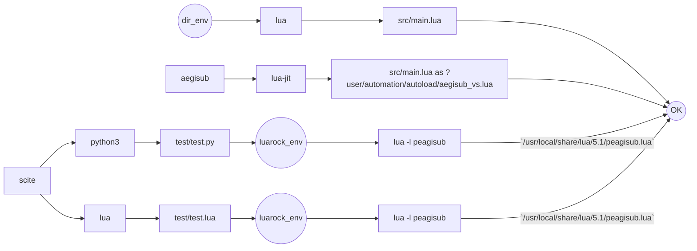
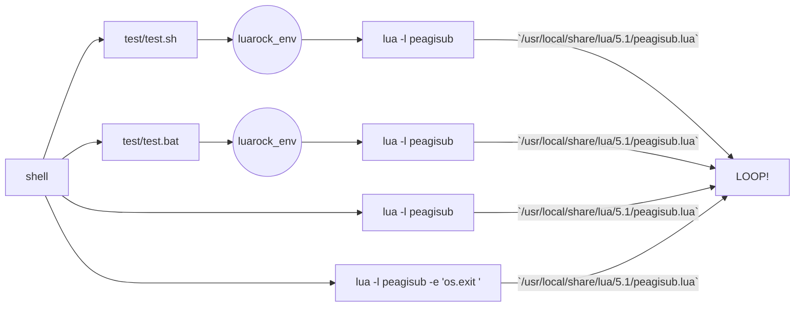

# Usage

This is lua helper is used to set the path needed by vapoursynth in arch1t3cht's aegisub fork.
It can be triggered many ways manually. 

Some works, 



some don't.




# Direct integration  

Modify the python bridge between aegisub and vapoursynth [aegisub-vs.py](https://raw.githubusercontent.com/arch1t3cht/Aegisub/vapoursynth/automation/vapoursynth/aegisub_vs.py) so that the ensure_plugin function can work after set_path being called.

```python
from dataclasses import dataclass, field
import os, sys

import pexpect
import subprocess


"""
  Wrapper to run a lua command with luarocks env available
  cmd : str  command to run 
"""
def run_luarocks_cmd(cmd : str):
    
    #Load luarocks env into os.environ
    child = pexpect.spawn('luarocks path --bin')
    LUA_PATH=child.readline()
    os.environ['LUA_PATH']=LUA_PATH.decode().split("'")[1]
    LUA_CPATH=child.readline()
    os.environ['LUA_CPATH']=LUA_CPATH.decode().split("'")[1]
    PATH=child.readline()
    os.environ['PATH']=PATH.decode().split("'")[1]
    child.close()

    cmd=cmd.split(" ")
    
    #force quit interactive mode, enabled by default 
    #even if -i is not set. This is a bug imho
    cmd.append("-e")
    cmd.append('os.exit()')
    
    result = subprocess.check_output(cmd)
    return result
    

### Config path detection  ########################

import re

@dataclass 
class Vsvars():
    
    _vars = None
    
    #Get ?user specifier path saved in config vsvars.json generated from lua
    def get_userdir(self):
        
        import platform

        system=platform.system()

        if system== 'Windows':
            osname = "Windows" 

        if system== 'Linux':
            osname = "Unix"
        
        if system== 'Darwin':
            osname = "Macintosh"

        if osname == "Windows" :
            home = os.getenv('appdata')
            user_dir= "Aegisub"

        if osname == "Unix":
            home = os.getenv('HOME')
            user_dir=".aegisub"

        if osname == "Macintosh" :
            home = os.getenv('HOME')
            user_dir= "Library/Application Support/Aegisub"
            
        return str(os.path.join(home, user_dir))
    
    def get_config_file(self):
        userdir=self.get_userdir(self)
        return str(os.path.join(userdir,"vsvars.json"))   
    
    def _get_datadir(self) :
        json_file_path=self.get_config_file(self)
        dirs={}
        
        if not os.path.exists(json_file_path):
            #Aegisub config vsvars.json is missing, we will call our luarock module peagisub to generate it =)
            #the src/main.lua module could have be copied into aegisub  ?user/automation/autoload 
            #as aegisub-vs.lua automation script to trigger it from menu giving more accurate results when aegisub runs
            result = run_luarocks_cmd('lua -l peagisub')
    
        if os.path.exists(json_file_path):
            with open(json_file_path, 'r') as file:
                json = file.read() #json.loads(j.read())
                p = re.compile('\s+"([^"]+)"\s+:\s+"([^"]+)"')
                paths=p.findall(json)
                for k, v in paths:
                    dirs[k] = v
        else:
            os.error("Can not find config file in '"+ json_file_path+"'")
        #extra to keep a track
        
        dirs["config"] = json_file_path
        return dirs
    
    @classmethod        
    def get(self, name):
        if self._vars is None:
             self._vars=self._get_datadir(self)
        try:
            return self._vars[name]
        except:
            return  "?"

try:
    import aegisub_vs as a
    __aegi_vscache =  Vsvars.get("cache")
    __aegi_vsplugins =   Vsvars.get("UserPluginDir")
    a.set_paths(locals())
except:
    print("Vapoursynth User Plugin dir is:"+Vsvars.get("UserPluginDir"))
```
